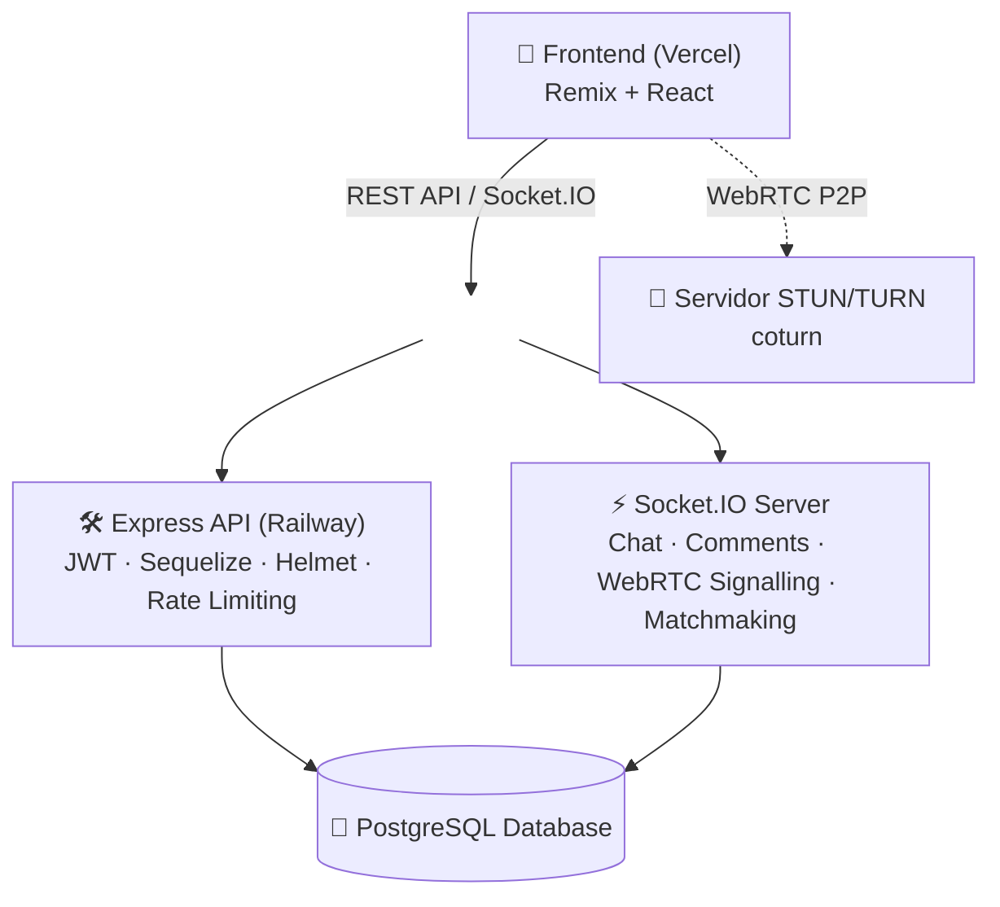

# FriendsGo 🌟

[](https://reactjs.org/)
[](https://remix.run/)
[](https://nodejs.org/)
[](https://expressjs.com/)
[](https://www.typescriptlang.org/)
[](https://www.postgresql.org/)
[](https://socket.io/)
[](https://choosealicense.com/licenses/mit/)

**[🔗 Demo en vivo](https://friendsgofrontend.vercel.app)** · [Documentación](#documentación) · [Instalación](#instalación)

> Frontend desplegado en **Vercel**, backend desplegado en **Railway**.

---

## Introducción

FriendsGo es una red social Full Stack desarrollada como Trabajo Final del CFGS de Desarrollo de Aplicaciones Web. Nace de una idea concreta: la persona media usa varias redes distintas para cubrir necesidades sociales diferentes (Instagram para contenido, Tinder/Omegle para conocer gente nueva, WhatsApp para chat). FriendsGo centraliza ese conjunto de funciones —publicaciones, perfiles, videollamadas aleatorias y chat— en una sola plataforma, combinando funcionalidades tradicionales de red social con comunicación en tiempo real mediante **Socket.IO** y videollamadas P2P mediante **WebRTC**.

El flujo social central es el siguiente: dos usuarios pueden conectarse mediante una videollamada aleatoria; si ambos deciden continuar la relación ("hacer match"), se habilita un chat persistente entre ellos. Al finalizar la llamada, cada usuario puede valorar la interacción, lo cual queda reflejado públicamente en el perfil del otro.

El proyecto se desarrolló en un plazo de tres meses siguiendo metodología **Scrum** (sprints semanales gestionados en Taiga.io), con el objetivo de diseñar una aplicación completa basada en una arquitectura cliente-servidor, poniendo especial énfasis en la comunicación en tiempo real, la seguridad y la organización del software.

> Desarrollado por dos personas: [SoyManoolo](https://github.com/SoyManoolo) y [Rediaj04](https://github.com/Rediaj04). Ver detalle de roles en [Equipo](#equipo).

---

## Características

### Red social
- Gestión de usuarios y perfiles.
- Sistema de publicaciones, comentarios y valoraciones.
- Sistema de amistades y solicitudes (búsqueda directa o tras videollamada).
- Búsqueda de usuarios.
- Moderación de contenido (panel de staff: sanciones, revisión de publicaciones y usuarios).

### Comunicación en tiempo real
- Videollamadas P2P aleatorias mediante WebRTC, con emparejamiento automático cada 5 segundos gestionado por el servidor.
- Si ambos usuarios hacen match durante la llamada, se habilita un chat persistente entre ellos vía Socket.IO.
- Valoración del interlocutor al finalizar la llamada, visible en su perfil.

### Backend
- API REST desarrollada con Express 5 y TypeScript, desplegada en Railway.
- PostgreSQL como base de datos principal, con Sequelize como ORM.
- Autenticación basada en JWT, con verificación adicional contra base de datos (permite invalidación real en logout).
- Rate limiting global y específico para autenticación (5 intentos / 15 min).
- Seguridad mediante Helmet, CORS y enforcement de HTTPS en producción.
- Testing de integración automatizado con Jest + Supertest.
- Internacionalización de mensajes en 7 idiomas (es, en, ca, de, fr, ja, zh).
- Logging dual (consola + base de datos) y tareas programadas (purga de logs y de datos eliminados, configurable por entorno).

### Frontend
- Remix (SSR) + React, con protección explícita contra SSR en todo lo que depende de APIs del navegador (Socket.IO, WebRTC, almacenamiento local).
- TailwindCSS 4.
- Diseño responsive.
- Fallback de vídeo sintético cuando no hay cámara disponible, para no romper la conexión P2P.

---

## Arquitectura



El frontend se comunica con el backend a través de dos canales: peticiones REST para operaciones CRUD convencionales (perfiles, publicaciones, amistades) y una conexión persistente vía Socket.IO para todo lo que requiere baja latencia (chat, señalización WebRTC, emparejamiento de videollamadas). Ambos canales comparten la misma base de datos PostgreSQL. El backend corre detrás de un proxy inverso en Railway, por lo que la aplicación fuerza HTTPS a nivel de código inspeccionando la cabecera `x-forwarded-proto`.

---

## Tecnologías

| Categoría | Tecnologías |
|---|---|
| **Frontend** | React 18, Remix 2 (SSR), Vite 6, TailwindCSS 4, TypeScript |
| **Backend** | Node.js, Express 5, TypeScript, Sequelize |
| **Base de datos** | PostgreSQL |
| **Tiempo real** | Socket.IO, WebRTC |
| **Autenticación** | JWT (con verificación en base de datos) |
| **Seguridad** | Helmet, CORS, express-rate-limit, enforcement de HTTPS |
| **Internacionalización** | i18n (7 idiomas) |
| **Testing** | Jest + Supertest |
| **Calidad de código** | ESLint |
| **Despliegue** | Vercel (frontend) · Railway (backend) |

---

## Decisiones técnicas

Algunas decisiones de diseño relevantes tomadas durante el desarrollo, junto con las alternativas que se valoraron:

- **Remix sobre Next.js y Astro:** se evaluaron React + Next.js, Angular y Vue para el frontend; se eligió React por su curva de aprendizaje razonable y el tamaño de su ecosistema. Para el framework, se valoró primero Next.js por su SSR/SSG, pero tras una comparativa más profunda se descartó por no ajustarse a los estándares buscados; entre las alternativas (Astro y Remix), se optó por Remix porque Astro está más orientado a sitios con contenido mayormente estático, mientras que Remix encaja mejor con una aplicación con estado e interacción constante.
- **Node.js sobre Deno y Bun:** se compararon los tres entornos de ejecución de JavaScript/TypeScript. Deno destaca en seguridad y Bun en rendimiento, pero se eligió Node.js por su comunidad más extensa, mayor disponibilidad de recursos y mejor compatibilidad con sistemas y servidores existentes — priorizando estabilidad y soporte sobre rendimiento marginal.
- **Express sobre NestJS:** se priorizó la simplicidad y el bajo nivel de imposición estructural de Express frente a frameworks más opinionados, lo que facilita la integración directa con Socket.IO y WebRTC sin pelear contra el framework.
- **PostgreSQL sobre MySQL y Cassandra:** se eligió PostgreSQL por su equilibrio entre potencia, consistencia fuerte y soporte de relaciones complejas (tipos JSONB, búsqueda full-text, integridad referencial). Cassandra se descartó porque prioriza disponibilidad sobre consistencia, lo cual no encajaba con un modelo de datos relacional como el de una red social.
- **WebRTC + Socket.IO para videollamadas:** WebRTC se eligió por permitir conexiones P2P de baja latencia con cifrado obligatorio, reduciendo carga de servidor. Socket.IO gestiona la señalización (intercambio de metadatos para establecer la conexión WebRTC) y se reutiliza como infraestructura común para chat y notificaciones, gracias a su reconexión automática y fallback sobre WebSockets. El proyecto despliega su propio servidor STUN/TURN (coturn), con TURNS cifrado como opción prioritaria y TURN sin cifrar como respaldo si el cifrado falla.
- **JWT + Helmet + CSP:** autenticación sin estado en servidor (escalable horizontalmente) combinada con cabeceras de seguridad estrictas para mitigar XSS e inyección de contenido. Las contraseñas se almacenan con hash (bcrypt), nunca en texto plano. Como matiz: el token no solo se verifica criptográficamente, sino que también se comprueba su existencia en base de datos, lo que permite invalidar sesiones de forma real en el logout (algo que un JWT puramente sin estado no permite).
- **TypeScript en todo el stack:** se decidió tipar tanto frontend como backend para detectar errores en tiempo de compilación y compartir un modelo de datos consistente entre ambas partes.
- **Emparejamiento de videollamadas con cola en memoria:** en vez de resolver el matching directamente vía Socket.IO en cada conexión, el servidor mantiene una cola de espera en memoria y ejecuta una ronda de emparejamiento aleatorio cada 5 segundos, creando el registro de llamada en base de datos y notificando a ambos usuarios quién actúa como iniciador de la señalización WebRTC.
- **Internacionalización en el backend, no solo en el frontend:** los mensajes de error y éxito de la API se traducen dinámicamente según la cabecera `Accept-Language` de cada petición (7 idiomas soportados), resueltos mediante una jerarquía de categorías de error en vez de un mapeo plano clave-valor.

### Calidad de código: refactorización del componente Post

Como ejercicio de mejora de mantenibilidad, el componente `Post` del frontend —que había crecido hasta 878 líneas con lógica de UI, estado y red mezclada— se descompuso en 7 componentes reutilizables (`UserAvatar`, `PostHeader`, `PostActions`, `PostComments`, `CommentInput`, `PostDescription`, `PostMedia`) y 3 hooks personalizados (`usePostLike`, `useComments`, `useTimeFormat`):

| Métrica | Antes | Después | Mejora |
|---|---|---|---|
| Líneas de código | 878 | 232 | −73% |
| Tamaño del archivo | 34 KB | 7 KB | −80% |
| Código duplicado (mobile/desktop) | ~300 líneas | 0 | −100% |
| Componentes reutilizables | 0 | 7 | — |

La duplicación entre las vistas de escritorio y móvil se resolvió con CSS responsive en lugar de ramas de código separadas, y la lógica de negocio (likes, comentarios, formateo de fechas) se extrajo a hooks independientes, lo que facilita testearla de forma aislada.

---

## Estructura del proyecto

```
M12/
├── frontend/          # ⚛️ Aplicación Remix + React (SSR)
│   └── app/
│       ├── routes/        # Rutas basadas en archivos (convención Remix)
│       ├── components/    # Inicio, Chats, Perfil, Videollamada, Shared
│       ├── hooks/          # useAuth, useVideoCall, useMessage...
│       ├── services/        # Servicios HTTP + singletons de Socket.IO/WebRTC
│       └── types/
├── Backend/           # 🛠️ Servidor Node.js + Express
│   └── src/
│       ├── controllers/   # Un controlador por dominio
│       ├── services/        # Lógica de negocio
│       ├── models/            # Modelos Sequelize + asociaciones
│       ├── routes/              # Endpoints REST
│       ├── socket/                # Eventos de Socket.IO (chat, comentarios, videollamadas)
│       ├── middlewares/             # Validación y manejo de errores
│       └── lang/                      # Traducciones (7 idiomas)
├── database/          # 💾 Scripts y schema de PostgreSQL
├── docs/              # 📚 Documentación del proyecto
│   ├── frontend/       # Documentación del frontend
│   ├── backend/        # Documentación del backend
│   └── api/             # Documentación de la API
└── LICENSE            # 📜 Licencia MIT
```

---

## Instalación

### Requisitos previos
- Node.js v18 o superior
- npm v9 o superior
- PostgreSQL v14 o superior
- Git

### Clonar el repositorio

```bash
git clone https://github.com/SoyManoolo/M12.git
cd M12
```

### Base de datos

```bash
psql
CREATE DATABASE friendsgo;
```

Configura las credenciales en el `.env` del backend:

```env
JWT_SECRET=tu_jwt_secret_seguro
PORT=3000
NODE_ENV=development

DB_PORT=5432
DB_USER=postgres
DB_PASS=tu_contraseña_postgres
DB_NAME=friendsgo
DB_NAME_TEST=friendsgo_test
DB_HOST=localhost
DB_UPDATE=true   # crea las tablas automáticamente al iniciar

LOGS_DAYS=7
CLEAN_USERS=30     # días de retención antes de purgar usuarios eliminados
CLEAN_POSTS=15     # días de retención antes de purgar publicaciones eliminadas
CLEAN_COMMENTS=7   # días de retención antes de purgar comentarios eliminados
```

### Backend

```bash
cd Backend
npm install
# Crea un archivo .env en esta carpeta con las variables del bloque anterior
npm run dev             # http://localhost:3000
```

### Frontend

```bash
cd frontend
npm install
echo "VITE_API_URL=http://localhost:3000" > .env
npm run dev             # http://localhost:5173
```

### Scripts disponibles

**Frontend**
| Comando | Descripción |
|---|---|
| `npm run dev` | Servidor de desarrollo (Vite) |
| `npm run build` | Build de producción (Remix + Vite) |
| `npm run lint` | Linter (ESLint) |
| `npm run preview` | Previsualiza el build de producción |
| `npm run analyze` | Analiza el bundle de producción |

**Backend**
| Comando | Descripción |
|---|---|
| `npm run dev` | Servidor de desarrollo (nodemon) |
| `npm run build` | Compila TypeScript y copia los ficheros de idioma |
| `npm start` | Modo producción |
| `npm run test` | Tests de integración con Jest + Supertest |
| `npm run test:watch` | Tests en modo watch |
| `npm run test:reset-db` | Resetea la base de datos de pruebas |
| `npm run sync-translations` | Sincroniza claves entre los ficheros de idioma |
| `npm run start:cleanup` / `stop:cleanup` / `delete:cleanup` | Gestiona el job de limpieza programada con PM2 |

---

## Alcance del proyecto

Como Trabajo Final de Grado desarrollado en tres meses, se tomaron decisiones conscientes de alcance para priorizar las funcionalidades core. El proyecto está desplegado públicamente (frontend en Vercel, backend en Railway) e incluye medidas de seguridad de nivel razonable —rate limiting, hash de contraseñas, invalidación de sesión vía base de datos, HTTPS forzado en producción—, pero quedan límites explícitos:

- No se han realizado pruebas formales de usabilidad o accesibilidad, aunque se siguieron patrones de diseño habituales en redes sociales para mantener una navegación intuitiva.
- El sistema de notificaciones en tiempo real vía Socket.IO está implementado pero no cubre aún el 100% de los eventos de la aplicación.
- No hay un pipeline de CI/CD formal ni monitorización de errores en producción más allá del logging propio.
- El emparejamiento de videollamadas funciona en memoria de un único proceso; escalar a varias instancias del backend requeriría mover esa cola a un almacén compartido (Redis, por ejemplo).

Documentar estas decisiones explícitamente —en vez de presentarlas como si no existieran— fue una elección deliberada: permite distinguir entre lo que está terminado, lo que es una limitación de alcance y lo que queda como trabajo futuro.

## Documentación

La documentación detallada de cada parte del proyecto vive en su propio README:

- 🎨 **[Frontend](docs/frontend/README.md)** — componentes, hooks, gestión de estado y rutas.
- 🔧 **[Backend](docs/backend/README.md)** — modelos, middleware, controladores y lógica de negocio.
- 🔌 **[API](docs/api/README.md)** — endpoints, autenticación y manejo de errores.
- 💾 **[Schema de base de datos](database/schema.sql)** — modelos, relaciones e índices.

## Visión de futuro

Funcionalidades identificadas como siguientes pasos naturales del proyecto:

- [ ] Llamadas y videollamadas directas entre amigos (no solo emparejamiento aleatorio).
- [ ] Extender los eventos de Socket.IO para que la interacción en tiempo real cubra toda la aplicación.
- [ ] Envío de imágenes y vídeos dentro del chat.
- [ ] Aplicación móvil nativa (Android e iOS).
- [ ] Inicio de sesión y registro mediante OAuth (Google / Facebook).

---

## Equipo

| | [SoyManoolo](https://github.com/SoyManoolo) | [Rediaj04](https://github.com/Rediaj04) |
|---|---|---|
| **Rol principal** | Backend | Frontend |
| **Responsabilidades** | Arquitectura del servidor, API REST, modelado de PostgreSQL, autenticación JWT, infraestructura Socket.IO, signalling WebRTC, servidor STUN/TURN, testing automatizado, seguridad (Helmet/CSP) | Interfaz con Remix y React, experiencia de usuario, componentes reutilizables, vistas de la aplicación, integración con la API REST, diseño responsive, soporte a funcionalidades en tiempo real |

---

## Aprendizajes

Este proyecto, además de los objetivos propios de la aplicación, se planteó como un ejercicio de crecimiento técnico para ambos desarrolladores. Permitió:

- Reforzar TypeScript, HTML y CSS de forma intensiva en un proyecto real de extremo a extremo.
- Adquirir experiencia práctica con React y Express más allá del nivel introductorio del ciclo formativo.
- Familiarizarse con WebRTC, Socket.io y Node.js mediante la implementación de funcionalidades de tiempo real desde cero, no a partir de tutoriales guiados.
- Diseñar e implementar una API REST completa, con autenticación, validación y manejo de errores propio.
- Modelar una base de datos relacional con relaciones complejas (amistades, publicaciones, valoraciones, moderación) manteniendo la integridad de los datos.
- Organizar un proyecto Full Stack de dos personas con metodología Scrum, gestionando sprints semanales y reparto de responsabilidades de forma autónoma.

---

## Licencia

Este proyecto está bajo la Licencia MIT. Ver el archivo [LICENSE](LICENSE) para más detalles.
