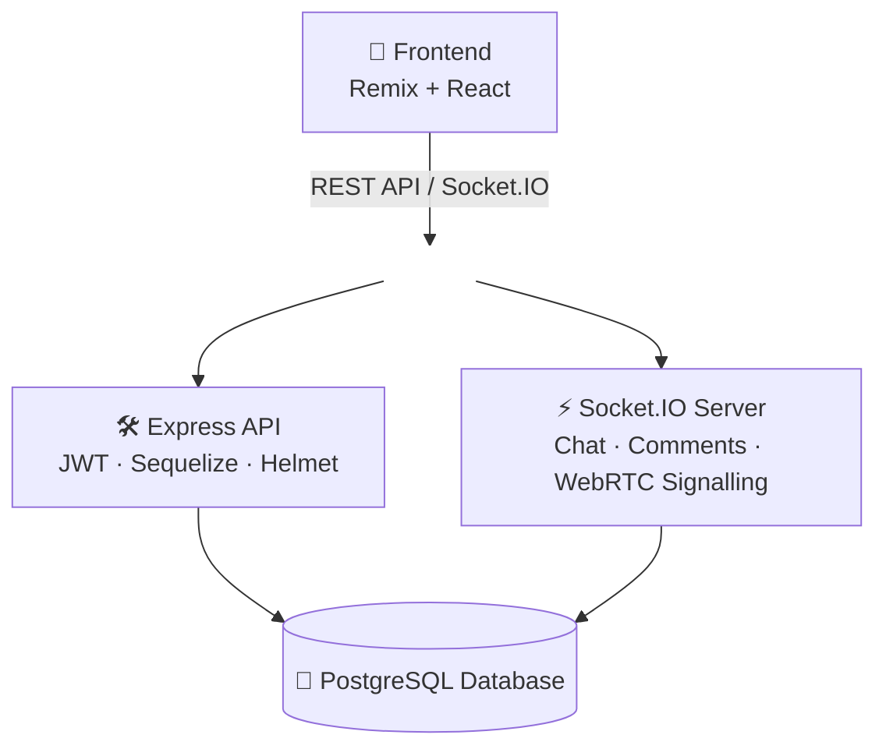

# FriendsGo 🌟

[](https://reactjs.org/)
[](https://remix.run/)
[](https://nodejs.org/)
[](https://expressjs.com/)
[](https://www.typescriptlang.org/)
[](https://www.postgresql.org/)
[](https://socket.io/)
[](https://choosealicense.com/licenses/mit/)

**[🔗 Demo en vivo](https://friendsgofrontend.vercel.app)** · [Documentación](#documentación) · [Instalación](#instalación)

---

## Introducción

FriendsGo es una red social Full Stack desarrollada como Trabajo Final del CFGS de Desarrollo de Aplicaciones Web. Nace de una idea concreta: la persona media usa varias redes distintas para cubrir necesidades sociales diferentes (Instagram para contenido, Tinder/Omegle para conocer gente nueva, WhatsApp para chat). FriendsGo centraliza ese conjunto de funciones —publicaciones, perfiles, videollamadas aleatorias y chat— en una sola plataforma, combinando funcionalidades tradicionales de red social con comunicación en tiempo real mediante **Socket.IO** y videollamadas P2P mediante **WebRTC**.

El flujo social central es el siguiente: dos usuarios pueden conectarse mediante una videollamada aleatoria; si ambos deciden continuar la relación ("hacer match"), se habilita un chat persistente entre ellos. Al finalizar la llamada, cada usuario puede valorar la interacción, lo cual queda reflejado públicamente en el perfil del otro.

El proyecto se desarrolló en un plazo de tres meses siguiendo metodología **Scrum** (sprints semanales gestionados en Taiga.io), con el objetivo de diseñar una aplicación completa basada en una arquitectura cliente-servidor, poniendo especial énfasis en la comunicación en tiempo real, la seguridad y la organización del software.

> Desarrollado por dos personas: [SoyManoolo](https://github.com/SoyManoolo) y [Rediaj04](https://github.com/Rediaj04). Ver detalle de roles en [Equipo](#equipo).

---

## Características

### Red social
- Gestión de usuarios y perfiles.
- Sistema de publicaciones, comentarios y valoraciones.
- Sistema de amistades y solicitudes (búsqueda directa o tras videollamada).
- Búsqueda de usuarios.
- Moderación de contenido (panel de staff: sanciones, revisión de publicaciones y usuarios).

### Comunicación en tiempo real
- Videollamadas P2P aleatorias mediante WebRTC, con servidor STUN/TURN como respaldo.
- Si ambos usuarios hacen match durante la llamada, se habilita un chat persistente entre ellos vía Socket.IO.
- Valoración del interlocutor al finalizar la llamada, visible en su perfil.

### Backend
- API REST desarrollada con Express y TypeScript.
- PostgreSQL como base de datos principal, con Sequelize como ORM.
- Autenticación basada en JWT.
- Seguridad mediante Helmet y Content Security Policy.
- Testing automatizado con Jest.
- Sistema de logs y limpieza programada con PM2.

### Frontend
- Remix + React.
- TailwindCSS.
- Diseño responsive.

---

## Arquitectura



El frontend se comunica con el backend a través de dos canales: peticiones REST para operaciones CRUD convencionales (perfiles, publicaciones, amistades) y una conexión persistente vía Socket.IO para todo lo que requiere baja latencia (chat, señalización WebRTC). Ambos canales comparten la misma base de datos PostgreSQL.

---

## Tecnologías

| Categoría | Tecnologías |
|---|---|
| **Frontend** | React, Remix, Vite, TailwindCSS, TypeScript |
| **Backend** | Node.js, Express, TypeScript, Sequelize |
| **Base de datos** | PostgreSQL |
| **Tiempo real** | Socket.IO, WebRTC (servidor STUN/TURN) |
| **Autenticación** | JWT |
| **Seguridad** | Helmet, Content Security Policy |
| **Testing** | Jest |
| **Calidad de código** | ESLint |
| **Despliegue** | Vercel (frontend) |

---

## Decisiones técnicas

Algunas decisiones de diseño relevantes tomadas durante el desarrollo, junto con las alternativas que se valoraron:

- **Remix sobre Next.js y Astro:** se evaluaron React + Next.js, Angular y Vue para el frontend; se eligió React por su curva de aprendizaje razonable y el tamaño de su ecosistema. Para el framework, se valoró primero Next.js por su SSR/SSG, pero tras una comparativa más profunda se descartó por no ajustarse a los estándares buscados; entre las alternativas (Astro y Remix), se optó por Remix porque Astro está más orientado a sitios con contenido mayormente estático, mientras que Remix encaja mejor con una aplicación con estado e interacción constante.
- **Node.js sobre Deno y Bun:** se compararon los tres entornos de ejecución de JavaScript/TypeScript. Deno destaca en seguridad y Bun en rendimiento, pero se eligió Node.js por su comunidad más extensa, mayor disponibilidad de recursos y mejor compatibilidad con sistemas y servidores existentes — priorizando estabilidad y soporte sobre rendimiento marginal.
- **Express sobre NestJS:** se priorizó la simplicidad y el bajo nivel de imposición estructural de Express frente a frameworks más opinionados, lo que facilita la integración directa con Socket.IO y WebRTC sin pelear contra el framework.
- **PostgreSQL sobre MySQL y Cassandra:** se eligió PostgreSQL por su equilibrio entre potencia, consistencia fuerte y soporte de relaciones complejas (tipos JSONB, búsqueda full-text, integridad referencial). Cassandra se descartó porque prioriza disponibilidad sobre consistencia, lo cual no encajaba con un modelo de datos relacional como el de una red social.
- **WebRTC + Socket.IO para videollamadas:** WebRTC se eligió por permitir conexiones P2P de baja latencia con cifrado obligatorio, reduciendo carga de servidor. Socket.IO gestiona la señalización (intercambio de metadatos para establecer la conexión WebRTC) y se reutiliza como infraestructura común para chat y notificaciones, gracias a su reconexión automática y fallback sobre WebSockets.
- **JWT + Helmet + CSP:** autenticación sin estado en servidor (escalable horizontalmente) combinada con cabeceras de seguridad estrictas para mitigar XSS e inyección de contenido. Las contraseñas se almacenan con hash (bcrypt), nunca en texto plano.
- **TypeScript en todo el stack:** se decidió tipar tanto frontend como backend para detectar errores en tiempo de compilación y compartir un modelo de datos consistente entre ambas partes.

### Calidad de código: refactorización del componente Post

Como ejercicio de mejora de mantenibilidad, el componente `Post` del frontend —que había crecido hasta 878 líneas con lógica de UI, estado y red mezclada— se descompuso en 7 componentes reutilizables (`UserAvatar`, `PostHeader`, `PostActions`, `PostComments`, `CommentInput`, `PostDescription`, `PostMedia`) y 3 hooks personalizados (`usePostLike`, `useComments`, `useTimeFormat`):

| Métrica | Antes | Después | Mejora |
|---|---|---|---|
| Líneas de código | 878 | 232 | −73% |
| Tamaño del archivo | 34 KB | 7 KB | −80% |
| Código duplicado (mobile/desktop) | ~300 líneas | 0 | −100% |
| Componentes reutilizables | 0 | 7 | — |

La duplicación entre las vistas de escritorio y móvil se resolvió con CSS responsive en lugar de ramas de código separadas, y la lógica de negocio (likes, comentarios, formateo de fechas) se extrajo a hooks independientes, lo que facilita testearla de forma aislada.

---

## Estructura del proyecto

```
M12/
├── frontend/          # ⚛️ Aplicación React + Remix
│   ├── app/           # Componentes y páginas
│   ├── public/        # Archivos estáticos
│   └── src/           # Código fuente
├── Backend/           # 🛠️ Servidor Node.js
│   ├── src/
│   │   ├── config/    # Configuraciones
│   │   ├── models/    # Modelos Sequelize
│   │   ├── routes/    # Rutas API
│   │   └── types/     # Tipos TypeScript
│   └── media/         # Archivos multimedia
├── database/          # 💾 Scripts y schema de PostgreSQL
├── docs/              # 📚 Documentación del proyecto
│   ├── frontend/       # Documentación del frontend
│   ├── backend/        # Documentación del backend
│   └── api/             # Documentación de la API
└── LICENSE            # 📜 Licencia MIT
```

---

## Instalación

### Requisitos previos
- Node.js v18 o superior
- npm v9 o superior
- PostgreSQL v14 o superior
- Git

### Clonar el repositorio

```bash
git clone https://github.com/SoyManoolo/M12.git
cd M12
```

### Base de datos

```bash
psql
CREATE DATABASE friendsgo;
```

Configura las credenciales en el `.env` del backend:

```env
JWT_SECRET=tu_jwt_secret_seguro
PORT=3000
NODE_ENV=development

DB_PORT=5432
DB_USER=postgres
DB_PASS=tu_contraseña_postgres
DB_NAME=friendsgo
DB_NAME_TEST=friendsgo_test
DB_HOST=localhost
DB_UPDATE=true   # crea las tablas automáticamente al iniciar

LOGS_DAYS=7
```

### Backend

```bash
cd Backend
npm install
cp .env.example .env   # edita con tus credenciales
npm run dev             # http://localhost:3000
```

### Frontend

```bash
cd frontend
npm install
cp .env.example .env   # edita con la URL del backend
npm run dev             # http://localhost:5173
```

### Scripts disponibles

**Frontend**
| Comando | Descripción |
|---|---|
| `npm run dev` | Servidor de desarrollo (Vite) |
| `npm run build` | Build de producción (Remix + Vite) |
| `npm run lint` | Linter (ESLint) |
| `npm run preview` | Previsualiza el build de producción |
| `npm run analyze` | Analiza el bundle de producción |

**Backend**
| Comando | Descripción |
|---|---|
| `npm run dev` | Servidor de desarrollo (nodemon) |
| `npm run build` | Compila TypeScript |
| `npm start` | Modo producción |
| `npm run test` | Tests con Jest |
| `npm run test:reset-db` | Resetea la base de datos de pruebas |
| `npm run sync-translations` | Sincroniza traducciones |
| `npm run start:cleanup` | Inicia job de limpieza con PM2 |

---

## Alcance del proyecto

Como Trabajo Final de Grado desarrollado en tres meses, se tomaron decisiones conscientes de alcance para priorizar las funcionalidades core sobre el endurecimiento de producción:

- El entorno objetivo es local/desarrollo; no se ha configurado un pipeline de despliegue en producción con monitorización o soporte técnico.
- Las contraseñas se almacenan con hash (bcrypt), pero no se han implementado medidas adicionales como límite de intentos de login o rate-limiting a nivel de API.
- No se han realizado pruebas formales de usabilidad o accesibilidad, aunque se siguieron patrones de diseño habituales en redes sociales para mantener una navegación intuitiva.
- El sistema de notificaciones en tiempo real vía Socket.IO está implementado pero no cubre aún el 100% de los eventos de la aplicación.

Documentar estas decisiones explícitamente —en vez de presentarlas como si no existieran— fue una elección deliberada: permite distinguir entre lo que está terminado, lo que es una limitación de alcance y lo que queda como trabajo futuro.

## Documentación

La documentación detallada de cada parte del proyecto vive en su propio README:

- 🎨 **[Frontend](docs/frontend/README.md)** — componentes, hooks, gestión de estado y rutas.
- 🔧 **[Backend](docs/backend/README.md)** — modelos, middleware, controladores y lógica de negocio.
- 🔌 **[API](docs/api/README.md)** — endpoints, autenticación y manejo de errores.
- 💾 **[Schema de base de datos](database/schema.sql)** — modelos, relaciones e índices.

## Visión de futuro

Funcionalidades identificadas como siguientes pasos naturales del proyecto:

- [ ] Llamadas y videollamadas directas entre amigos (no solo emparejamiento aleatorio).
- [ ] Extender los eventos de Socket.IO para que la interacción en tiempo real cubra toda la aplicación.
- [ ] Envío de imágenes y vídeos dentro del chat.
- [ ] Aplicación móvil nativa (Android e iOS).
- [ ] Inicio de sesión y registro mediante OAuth (Google / Facebook).

---

## Equipo

| | [SoyManoolo](https://github.com/SoyManoolo) | [Rediaj04](https://github.com/Rediaj04) |
|---|---|---|
| **Rol principal** | Backend | Frontend |
| **Responsabilidades** | Arquitectura del servidor, API REST, modelado de PostgreSQL, autenticación JWT, infraestructura Socket.IO, signalling WebRTC, servidor STUN/TURN, testing automatizado, seguridad (Helmet/CSP) | Interfaz con Remix y React, experiencia de usuario, componentes reutilizables, vistas de la aplicación, integración con la API REST, diseño responsive, soporte a funcionalidades en tiempo real |

---

## Aprendizajes

Este proyecto, además de los objetivos propios de la aplicación, se planteó como un ejercicio de crecimiento técnico para ambos desarrolladores. Permitió:

- Reforzar TypeScript, HTML y CSS de forma intensiva en un proyecto real de extremo a extremo.
- Adquirir experiencia práctica con React y Express más allá del nivel introductorio del ciclo formativo.
- Familiarizarse con WebRTC, Socket.io y Node.js mediante la implementación de funcionalidades de tiempo real desde cero, no a partir de tutoriales guiados.
- Diseñar e implementar una API REST completa, con autenticación, validación y manejo de errores propio.
- Modelar una base de datos relacional con relaciones complejas (amistades, publicaciones, valoraciones, moderación) manteniendo la integridad de los datos.
- Organizar un proyecto Full Stack de dos personas con metodología Scrum, gestionando sprints semanales y reparto de responsabilidades de forma autónoma.

---

## Licencia

Este proyecto está bajo la Licencia MIT. Ver el archivo [LICENSE](LICENSE) para más detalles.
