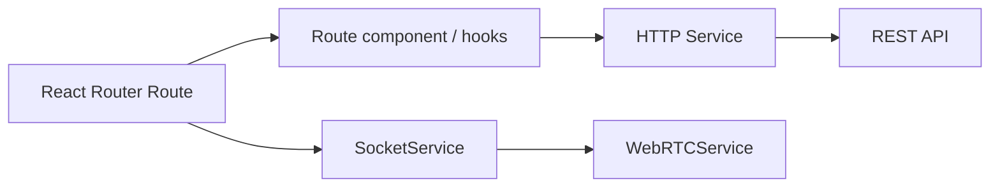

# Frontend — FriendsGo

> Documentación técnica de la aplicación cliente de FriendsGo. Para la visión general del proyecto, ver el [README principal](../../README.md).

## Índice

1. [Arquitectura](#arquitectura)
2. [Stack técnico](#stack-técnico)
3. [Estructura del código](#estructura-del-código)
4. [Decisiones de implementación](#decisiones-de-implementación)
5. [Comunicación en tiempo real](#comunicación-en-tiempo-real)
6. [Seguridad y sesión](#seguridad-y-sesión)
7. [Pruebas](#pruebas)
8. [Componente destacado: refactorización de Post](#componente-destacado-refactorización-de-post)
9. [Estilos](#estilos)
10. [Instalación](#instalación)
11. [Scripts disponibles](#scripts-disponibles)
12. [Licencia](#licencia)

---

## Arquitectura

El frontend es una aplicación de **React Router 7** sobre React 18, con renderizado en servidor (SSR), Vite y rutas basadas en archivos. Los servicios HTTP gestionan las operaciones convencionales de la API REST, mientras que dos servicios singleton independientes —`SocketService` y `WebRTCService`— administran la comunicación en tiempo real (chat y señalización de videollamadas) desde el cliente.



Como React Router puede renderizar primero en el servidor, **toda pieza que depende de APIs del navegador (WebSocket, WebRTC, `localStorage`) está protegida explícitamente contra SSR** con comprobaciones `typeof window === 'undefined'`. El patrón aparece en `SocketService`, `WebRTCService`, `useAuth` y en la utilidad de decodificación de JWT, que mantiene una ruta segura para servidor y navegador.

---

## Stack técnico

| Categoría | Tecnología |
|---|---|
| Framework | React Router 7.18 sobre React 18 (SSR) |
| Build tool | Vite 6 |
| Lenguaje | TypeScript |
| Estilos | Tailwind CSS 4 (`@tailwindcss/vite`, sin PostCSS clásico) |
| Tiempo real | Socket.IO client |
| Videollamadas | WebRTC nativo del navegador |
| Componentes UI | Headless UI |
| Fechas | date-fns |
| Emojis | emoji-mart + emoji-picker-react |
| Sanitización | DOMPurify |
| Pruebas | Vitest + Testing Library |
| Linting | ESLint (typescript-eslint, react-hooks, jsx-a11y) |
| Despliegue | Vercel |

---

## Estructura del código

```
app/
├── routes/              # Rutas basadas en archivos de React Router
├── components/
│   ├── Inicio/             # Feed, navbar, publicaciones
│   ├── Chats/               # Lista de chats, picker de emojis
│   ├── Perfil/                # Perfil de usuario y sus publicaciones
│   ├── Videollamada/            # UI de videollamada, chat in-call, valoración
│   └── Shared/                    # Modales, notificaciones, imagen segura, panel lateral
├── hooks/
│   ├── post/                # Hooks específicos del dominio Post (ver más abajo)
│   ├── useAuth.tsx            # Context + hook de sesión
│   ├── useMessage.tsx           # Lógica de chat
│   └── useVideoCall.ts            # Lógica de videollamada sobre WebRTCService
├── services/
│   ├── socket.service.ts    # Singleton: conexión Socket.IO, SSR-safe
│   ├── webrtc.service.ts      # Singleton: RTCPeerConnection, señalización, fallback de stream
│   ├── *.service.ts             # Un servicio HTTP por dominio (auth, user, post, chat, comment, friendship)
├── config/                # environment.ts (URL de API), rtc.config.ts (servidores ICE)
├── types/                  # Tipos compartidos por dominio
└── utils/                   # token.ts, sanitize.ts y utilidades SSR-safe
```

Las rutas siguen una convención plana basada en archivos (`admin.publicaciones.tsx` ⇒ `/admin/publicaciones`), con un área `/admin/*` separada para moderación (usuarios, publicaciones y estadísticas).

---

## Decisiones de implementación

- **Servicios de tiempo real como singletons, no como hooks:** `SocketService` y `WebRTCService` se implementan como clases singleton en lugar de hooks de React, porque su estado (la conexión socket, el `RTCPeerConnection`) debe sobrevivir a remontados de componentes y ser accesible desde distintas partes del árbol sin pasar por prop drilling. Los hooks (`useVideoCall`, `useMessage`) son la capa que conecta estos servicios con el ciclo de vida de React mediante callbacks (`setUICallbacks`, `onConnect`).
- **Import dinámico de `socket.io-client`:** en vez de un `import` estático, `SocketService` carga la librería con `await import('socket.io-client')` solo cuando se ejecuta en el cliente, evitando resolverla durante el SSR.
- **Buffer de candidatos ICE:** en `WebRTCService`, los candidatos ICE que llegan antes de que la descripción remota (oferta/respuesta SDP) esté establecida se almacenan en un buffer y se procesan en cuanto la conexión está lista, evitando una condición de carrera típica de WebRTC cuando la señalización llega desordenada.
- **Fallback de vídeo sintético:** si `getUserMedia` no puede obtener una pista de vídeo (cámara no disponible o permiso denegado), el servicio genera un stream de vídeo placeholder mediante `canvas.captureStream()` a 15 FPS, para que la conexión P2P no se rompa y el usuario pueda seguir en la llamada con audio.
- **Autenticación con degradación de almacenamiento:** `useAuth` guarda el token en `localStorage` y cae a `sessionStorage` si falla (Safari/iOS en modo privado puede lanzar excepciones al acceder a `localStorage`), en lugar de romper el flujo de login.
- **`isAuthenticated` depende también del estado de carga:** se calcula como `!!token && !isLoading` en vez de solo `!!token`, para evitar una redirección prematura a login mientras todavía se está verificando el token contra el backend.
- **Code-splitting manual en Vite:** `vite.config.ts` separa manualmente los chunks de vendor (`react`, `react-router`, `socket.io-client`, `date-fns`) para optimizar la carga inicial en producción.

---

## Comunicación en tiempo real

El cliente se conecta al servidor de Socket.IO autenticándose con el JWT (`auth: { token }`), forzando el transporte `websocket` (sin fallback a polling) y con reconexión automática configurada (5 intentos, 1s de espera).

El flujo de una videollamada, de principio a fin:

1. El usuario entra en la cola (`ADD_TO_QUEUE`) desde `useVideoCall` → `WebRTCService.joinQueue()`.
2. El backend empareja usuarios cada 5 segundos y emite `match_found` a ambos, indicando quién actúa como iniciador.
3. El iniciador crea la oferta SDP (`createOffer`) y la envía vía `SEND_OFFER`; el receptor responde con `SEND_ANSWER`.
4. Ambos extremos intercambian candidatos ICE (`SEND_ICE_CANDIDATE`) hasta establecer la conexión P2P.
5. Al colgar, `endCall()` notifica al otro extremo, libera el `MediaStream` local y cierra el `RTCPeerConnection`.

---

## Seguridad y sesión

- **Contenido generado por usuarios:** `sanitizeUserText` centraliza DOMPurify y elimina marcado HTML tanto en el navegador como durante SSR. Se aplica a publicaciones, comentarios, biografías y mensajes de chat, incluido el chat de videollamada.
- **Expiración del JWT:** `useAuth` descarta tokens vencidos durante la inicialización y programa el cierre de sesión cuando vence el token activo. Las rutas protegidas redirigen posteriormente al login.
- **Recuperación de contraseña:** la ruta `/forgot-password` ofrece un formulario de correo y muestra respuestas genéricas para no revelar si existe una cuenta. El cliente solicita `POST /auth/forgot-password`; el backend debe implementar el envío del correo, el token temporal y su expiración.
- **Relaciones sociales:** el feed cliente muestra publicaciones propias y de amistades confirmadas, las sugerencias excluyen contactos existentes y los historiales de chat se conservan tras eliminar una amistad.

---

## Pruebas

El frontend usa Vitest para pruebas unitarias de utilidades. Actualmente cubre la detección de JWT válidos, vencidos y malformados, además de la eliminación de scripts y marcado inseguro durante la sanitización.

```bash
npm test
npm run test:watch
```

Antes de publicar cambios se recomienda ejecutar además:

```bash
npm run build
node node_modules/typescript/bin/tsc --noEmit -p tsconfig.app.json
```

---

## Componente destacado: refactorización de Post

El componente `Post` original (878 líneas, lógica de UI/estado/red mezclada, ~300 líneas duplicadas entre las variantes de escritorio y móvil) se descompuso en 7 componentes (`UserAvatar`, `PostHeader`, `PostActions`, `PostComments`, `CommentInput`, `PostDescription`, `PostMedia`) y 3 hooks (`usePostLike`, `useComments`, `useTimeFormat`), reduciendo el componente principal a 232 líneas:

| Métrica | Antes | Después |
|---|---|---|
| Líneas de código | 878 | 232 (−73%) |
| Tamaño del archivo | 34 KB | 7 KB (−80%) |
| Duplicación mobile/desktop | ~300 líneas | 0 (resuelto con CSS responsive) |

La migración ya está aplicada en el código actual (no coexisten `Post.tsx` y una versión "refactorizada" en paralelo). Detalle completo en [`components/Inicio/Post/README.md`](../../frontend/app/components/Inicio/Post/README.md).

---

## Estilos

Tailwind CSS 4 integrado vía el plugin oficial de Vite (`@tailwindcss/vite`), sin archivo `tailwind.config.js` de tipo PostCSS clásico para el pipeline de build. Se complementa con `tailwind-scrollbar` para estilizar scrollbars y Headless UI para componentes accesibles sin estilos propios (modales, menús desplegables).

---

## Instalación

### Requisitos previos
- Node.js 20+ y npm 9+

### Pasos

```bash
git clone https://github.com/SoyManoolo/M12.git
cd M12/frontend
npm install
```

Crea un `.env` en la raíz del frontend:

```env
VITE_API_URL=http://localhost:3000
```

```bash
npm run dev   # http://localhost:5173
```

---

## Scripts disponibles

| Comando | Descripción |
|---|---|
| `npm run dev` | Servidor de desarrollo (React Router + Vite) |
| `npm run build` | Build SSR de producción (`react-router build`) |
| `npm start` | Sirve el build SSR fuera de Vercel |
| `npm test` | Ejecuta las pruebas unitarias de Vitest |
| `npm run test:watch` | Ejecuta Vitest en modo observación |
| `npm run preview` | Previsualiza el build de producción |
| `npm run lint` | ESLint |
| `npm run analyze` | Build en modo análisis de bundle |

---

## Licencia

Este proyecto está bajo la Licencia MIT. Ver el archivo [LICENSE](../../LICENSE) en la raíz del repositorio.
